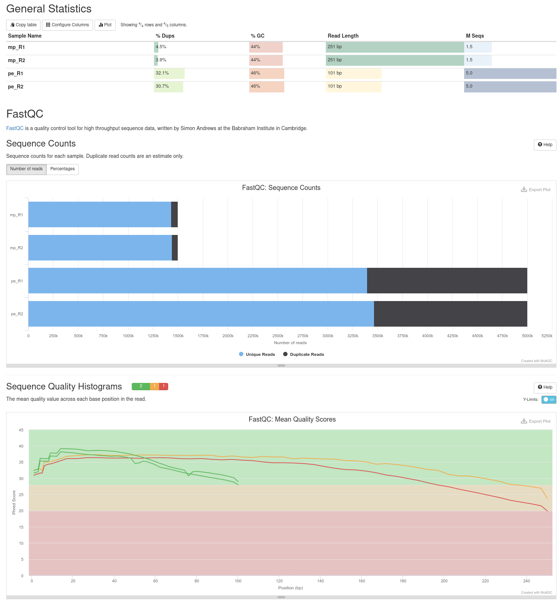
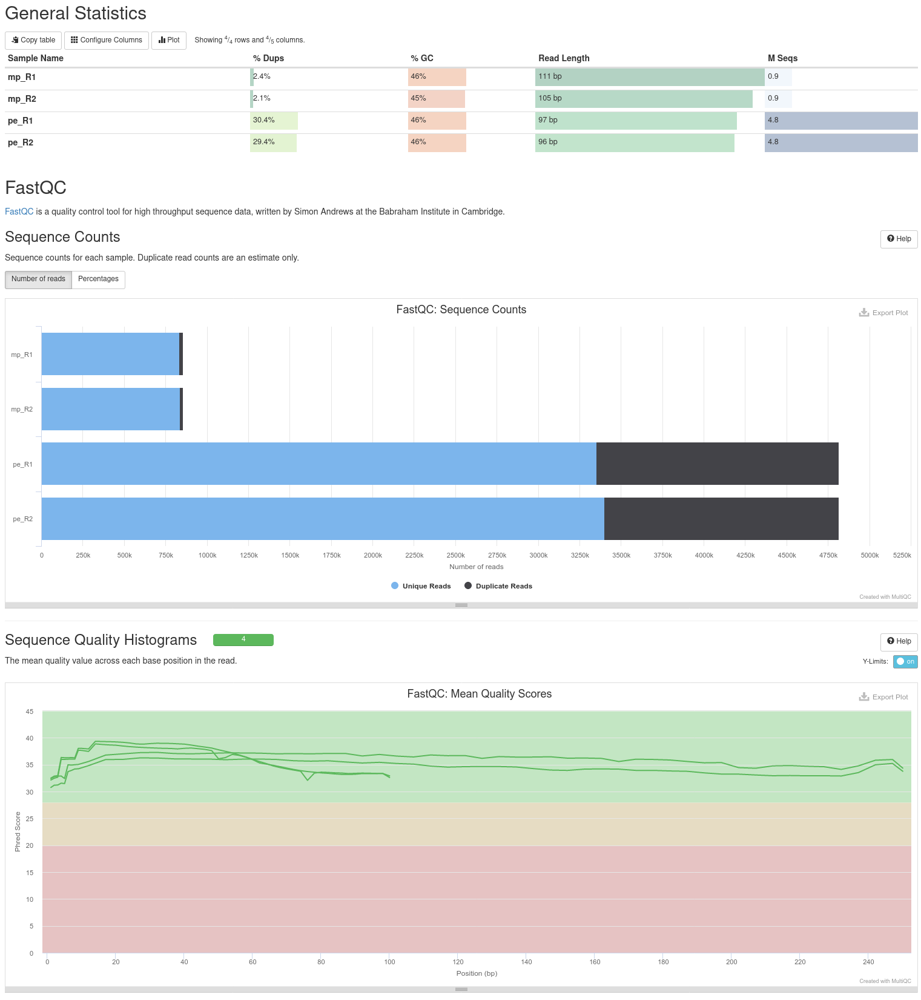
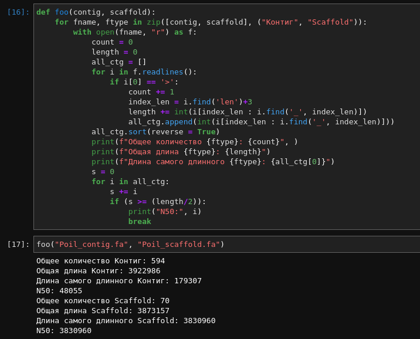
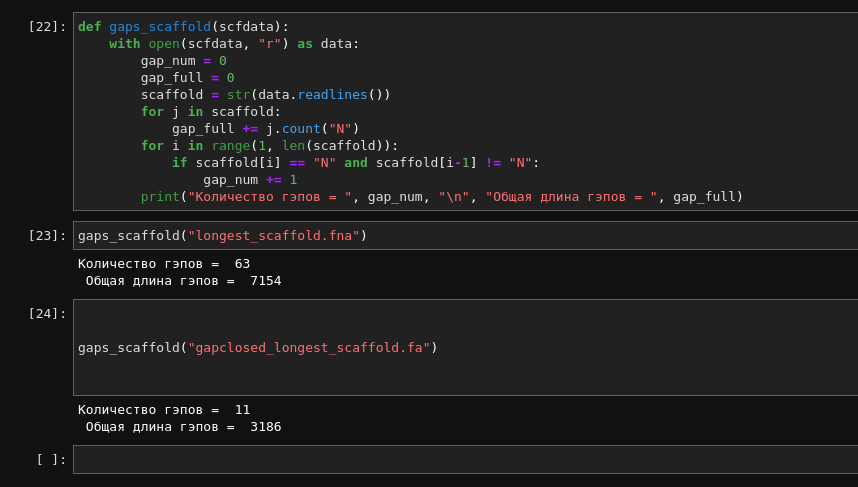
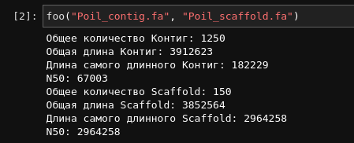
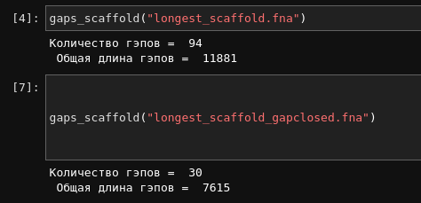

# hse22_hw1
### Выполнил студент 3 курса ФХ НИУ ВШЭ Василий Митурич
-----

Создадим ссылки на файлы с данными:

    ln -s /usr/share/data-minor-bioinf/assembly/oil_R1.fastq
    ln -s /usr/share/data-minor-bioinf/assembly/oil_R2.fastq
    ln -s /usr/share/data-minor-bioinf/assembly/oilMP_S4_L001_R1_001.fastq
    ln -s /usr/share/data-minor-bioinf/assembly/oilMP_S4_L001_R2_001.fastq

Создадим семплы данных:

    seqtk sample -s121 oil_R1.fastq 5000000 > R1sub.fq
    seqtk sample -s121 oil_R2.fastq 5000000 > R2sub.fq
    seqtk sample -s121 oilMP_S4_L001_R1_001.fastq 1500000 > MPR1sub.fq
    seqtk sample -s121 oilMP_S4_L001_R2_001.fastq 1500000 > MPR2sub.fq

Собираем отчёт multiqc:

    mkdir fastqc
    ls *.fq | xargs -P 4 -tI{} fastqc -o fastqc {}
    mkdir multiqc
    multiqc -o multiqc fastqc

Делаем подрезку при помощи `Platanus`:

    platanus_trim R1sub.fq R2sub.fq | tee platanus_trim.log
    platanus_internal_trim MPR1sub.fq MPR2sub.fq | tee platanus_internal_trim.log

Собираем отчёт multiqc после обрезки:

    mkdir trimmed_fastq
    mv -v *trimmed trimmed_fastq/
    mkdir trimmed_fastqc
    ls trimmed_fastq/* | xargs -P 4 -tI{} fastqc -o trimmed_fastqc {}
    mkdir trimmed_multiqc
    multiqc -o trimmed_multiqc trimmed_fastqc

Теперь сравним отчёт MultiQC до и после обрезки:

#### До

#### После

Качество сборки значительно увеличилось.

Собираем контиги:

    time platanus assemble -o Poil -f trimmed_fastq/R1sub.fq.trimmed trimmed_fastq/R2sub.fq.trimmed | tee assemble.log

Собираем скаффолды:

    time platanus scaffold -o Poil -c Poil_contig.fa -IP1 trimmed_fastq/R1sub.fq.trimmed  trimmed_fastq/R2sub.fq.trimmed -OP2 trimmed_fastq/MPR1sub.fq.int_trimmed trimmed_fastq/MPR2sub.fq.int_trimmed | tee scaffold.log

Проведём анализ контигов и скаффолдов:

Уменьшаем число гэпов:

    time platanus gap_close -o Poil -c Poil_scaffold.fa -IP1 trimmed_fastq/R1sub.fq.trimmed  trimmed_fastq/R2sub.fq.trimmed -OP2 trimmed_fastq/MPR1sub.fq.int_trimmed trimmed_fastq/MPR2sub.fq.int_trimmed | tee gap_close.log

Записываем самый длинный скаффолд

    echo scaffold1_len3830960_cov232 > longest_scaffold.txt
    seqtk subseq Poil_scaffold.fa longest_scaffold.txt > longest_scaffold.fa

Создаем файл с самым длинным скаффолдом уже после использования platanus gap_close

    echo scaffold1_cov232 > longest_scaffold.txt
    seqtk subseq Poil_gapClosed.fa longest_scaffold.txt > gapclosed_longest_scaffold.fa

Теперь при помощи питона проверим требуемые гэпы:

Не забываем удалить fastq-файлы:

    rm *.fastq

-----

## Доп. пункт на 10 баллов
Сделаем всё то же самое, но уменьшим выборку в самом начале:

    seqtk sample -s121 oil_R1.fastq 1000000 > R1sub.fq
    seqtk sample -s121 oil_R2.fastq 1000000 > R2sub.fq
    seqtk sample -s121 oilMP_S4_L001_R1_001.fastq 300000 > MPR1sub.fq
    seqtk sample -s121 oilMP_S4_L001_R2_001.fastq 300000 > MPR2sub.fq

Проведём те же операции и получим:

Видно, что качество сборки сильно упало - число и длина гэпов резко увеличились.
